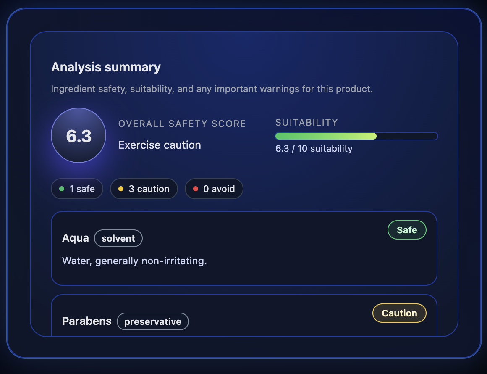
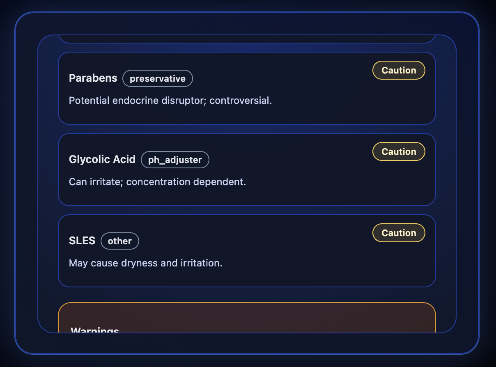
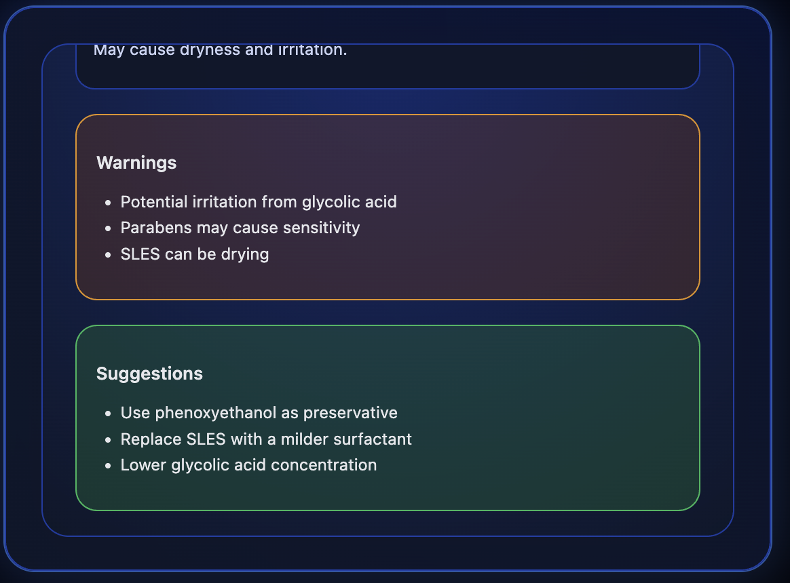

# 🧪 What's Inside Label AI

### 🔍 AI-Powered Ingredient Safety Analyzer

What's Inside Label AI is a web-based tool that helps users **understand ingredient safety instantly** for skincare and food products.

Paste an ingredient list, select a product type, and receive a **clear, conservative safety analysis** with visual signals, an overall score, and smarter insights — all in a clean, futuristic interface.

## 🖼️ Application Preview (Live Images):

## 🛠️ Built With

### 🔧 Backend & AI
- **FastAPI** — high-performance Python backend for handling analysis requests
- **LLM-based analysis pipeline** — interprets ingredient lists and generates structured safety insights
- **Custom ingredient evaluation logic** — classifies ingredients into safety levels (Safe / Caution / Avoid)
- **Rule-guided + AI-assisted reasoning** — ensures conservative, non-medical guidance
- **REST API architecture** — clean request/response design for frontend integration

### 🎯 Core Backend Responsibilities
- Parse and normalize raw ingredient lists
- Analyze ingredient risk and safety signals
- Compute an overall product safety score
- Generate structured explanations and alternative suggestions
- Return deterministic, frontend-ready JSON responses

## ✨ Key Features

### 🟢 Safety Signal System

* 🟢 **Safe (Green)** — Generally well-tolerated ingredients
* 🟡 **Caution (Yellow)** — Ingredients that may cause sensitivity
* 🔴 **Avoid (Red)** — Potentially irritating or higher-risk ingredients

### 📊 Overall Product Safety Score

* Generates a **conservative overall safety score**
* Helps users quickly assess product suitability
* Designed for clarity, not medical diagnosis

### 🔁 Smarter Ingredient Insights

* Highlights concerning ingredients
* Suggests **gentler alternative ingredients**
* Encourages informed decision-making

### ⚡ Instant AI Analysis

* Paste ingredient list
* Choose product type (Skincare / Food)
* Get results instantly

## 🧠 Design Philosophy

* Conservative, **non-medical guidance**
* Color-coded signals for fast scanning
* Scroll-contained results (no page jumping)
* Modern, minimal, futuristic UI

## 🎯 Why This Project Matters

* Simplifies complex ingredient data
* Helps users make safer product choices
* Demonstrates real-world AI + frontend engineering
* Built with a product-first mindset

## ⚠️ Disclaimer

This tool provides **educational, non-medical guidance only** and does not replace professional advice.
